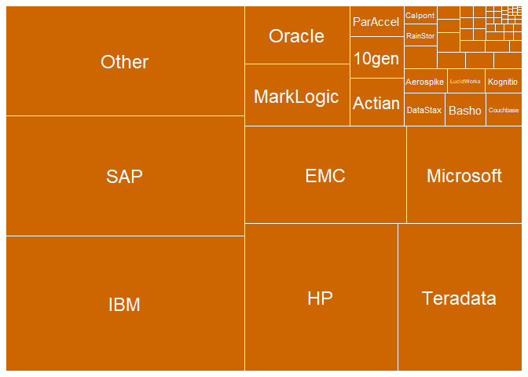

# Introduction

This file shows some examples of treemaps. Treemaps are a modern way of displaying something like a pie chart. But unlike pie charts, treemaps also allow 3 variables (columns of data) to be displayed in one graph.

# Market Leaders

The data comes from a bar chart on this page: 
[Big Data Database Revenue and Market Forecast 2012-2017](http://wikibon.org/wiki/v/Big_Data_Database_Revenue_and_Market_Forecast_2012-2017).


```r
leaders <- read.csv("market.csv", stringsAsFactors = FALSE)
head(leaders)
```


Name         Value
----------  ------
IBM            215
SAP            190
HP             150
Teradata       122
EMC            105
Microsoft       75

# TreeMap

This is an example using the `treemap` package.


```r
treemap(leaders, #Your data frame object
        index=c("Name"),  #A list of your categorical variables
        vSize = "Value",  #This is your quantitative variable
        type="index", #Type sets the organization and color scheme of your treemap
        palette = "Blues",  #Select your color palette from the RColorBrewer presets or make your own.
        title="Big Data Market Leaders 2012", #Customize your title
        fontsize.title = 14 #Change the font size of the title
        )
```

<!-- -->


# Treemapify

Treemapify works with ggplot, so it is preferable and is used in the remainder of this document.

The next treemap uses the G20 dataset.


```r
ggplot(G20, aes(area = gdp_mil_usd, 
                fill = econ_classification, 
                label = country,
                subgroup = econ_classification)) +
  geom_treemap() +
  geom_treemap_text(place = "center", reflow = TRUE)
```

<!-- -->

The SetTextContrastColor function comes from [Chart of R Colors](http://research.stowers.org/mcm/efg/R/Color/Chart/).
Sets a reasonable contrast color for text on the given background color.


```r
# Function to set the text to a color that contrasts with the tile's background
SetTextContrastColor <- function(color)
{
  ifelse( mean(col2rgb(color)) > 127, "black", "white")
}

# Alternate colors
gOrange   <- rgb(255, 150, 52, maxColorValue=255)
gTan      <- rgb(226, 216, 169, maxColorValue=255)
gBlueGray <- rgb(128, 143, 179, maxColorValue=255)
gDarkBlue <- rgb( 63, 106, 163, maxColorValue=255)
```

Here is a treemap using two data columns.


```r
tile_color <- "darkorange3"
# tile_color <- gOrange
# tile_color <- gDarkBlue

ggplot(leaders,
       ggplot2::aes(area = Value, 
                    label = Name)) +
  geom_treemap(fill = tile_color, col="white") +
  geom_treemap_text(col = SetTextContrastColor(tile_color), place = "centre")
```

<!-- -->

We can color tiles based on their value.


```r
ggplot(leaders,
       aes(area = Value, label = Name)) +
  scale_fill_gradientn(colors = rev(heat.colors(5))) +
  geom_treemap(aes(fill = Value), col = 'darkgray') +
  geom_treemap_text(col = "black", place = "center") +
  ggtitle(label = "Market Leaders 2012")
```

<!-- -->


# Bar Chart

Next consider a bar chart, sorted by value and filtering out small values.


```r
leaders %>%
  filter(Value >= 4) %>%  
  ggplot(aes(y=Value, x=reorder(Name, Value))) +
  geom_col(fill="blue", alpha=.5)+
  coord_flip() +
  geom_text(aes(label=paste("$", Value, sep="")), position = position_nudge(y=8)) +
  labs(x="Company", y="Big Data Revenue in Millions", title = "Big Data Market Leaders 2012")
```

<!-- -->

# Palettes

## Color Blind Palettes

These palettes create sets of colors that color blind people can distinguish, and so they are to be preferred.


```r
display.brewer.all(
  n = NULL,
  type = "all",
  select = NULL,
  exact.n = FALSE,
  colorblindFriendly = TRUE
)
```

<!-- -->


## Modifying palettes

This adds a grey color to an existing palette, to make South America stand out in the next treemap.


```r
yellow_red_pal <- brewer.pal(7,"YlOrRd")
format.hexmode(127)
```

```
## [1] "7f"
```

```r
format.hexmode(128+64-1)
```

```
## [1] "bf"
```

```r
g20pal <- c(yellow_red_pal, "#BFBFBF")
g20pal
```

```
## [1] "#FFFFB2" "#FED976" "#FEB24C" "#FD8D3C" "#FC4E2A" "#E31A1C" "#B10026"
## [8] "#BFBFBF"
```

# G20 GDP


These treemaps have subgroups. This allows display of another variable (data column), this case, the region.

Here is a treemap using the new palette.


```r
ggplot(G20,
       aes(area = gdp_mil_usd, 
           fill = region, 
           label = country,
           subgroup = region)) +
  scale_fill_manual(values = g20pal) +
  geom_treemap() +
  geom_treemap_text() +
  labs(title = "G20 GDPs")
```

<!-- -->

Here is one with a nice palette.


```r
ggplot(G20,
       aes(area = gdp_mil_usd, 
           fill = region, 
           label = country,
           subgroup = region)) +
  scale_fill_brewer(palette = "Paired") +
  geom_treemap(col = "black") +
  geom_treemap_text(place = "center", reflow = TRUE, fontface = 'bold') +
  geom_treemap_subgroup_border(col = "white", size = 2) +
  geom_treemap_subgroup_text(place = "bottom", col = "white", alpha = .8, 
                             size = 16, fontface = 'bold', reflow = T) +
  labs(title = "G20 GDPs")
```

<!-- -->
